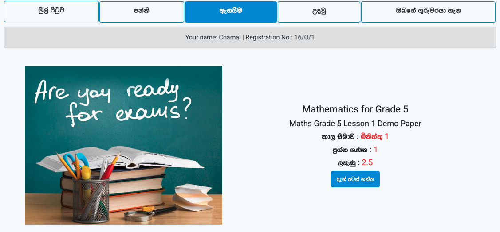

## Open Examination  
  
  
  




Open Examination is an **open-source** online examination management system, designed for **tech start-ups** and **independent developers** who want to build and customize their own examination management solution.  


---

## ✨ Features  

The system includes several modules to assist with day-to-day exam operations:  

- **Student Management** – Maintain student records, admissions, and profiles.  
- **Teacher Management** – Manage teacher information, schedules, and assignments.  
- **Classroom Management** – Organize classes, timetables, and room allocations.  
- **Examination Management** – Create and manage exams, results, and grading.  
- **User Management** – Add, edit, and manage user roles and permissions.  
- **Payment Management** – Add, edit, and manage payments.  

---

## 🚀 Getting Started  

Follow these instructions to set up the project locally for development or testing.  

### ✅ Prerequisites  

- PHP >= 7.4 (Recommended: PHP 8.x)  
- MySQL or MariaDB  
- Apache or Nginx  
- Composer  

### 📥 Installation  

1. **Clone the repository:**  
   ```bash
   git clone https://github.com/your-username/open-school-management-system.git
   cd open-school-management-system
   ```

2. **Install dependencies:**

   ```bash
   composer install
   ```

3. **Configure environment:**

   * Copy `.env.example` to `.env`:

     ```bash
     cp .env.example .env
     ```
   * Update database credentials and other necessary configurations in `.env`.
   * Generate app key in `.env`.
      ```bash
      php artisan key:generate
      ```
   

4. **Run database migrations:**

   ```bash
   php artisan migrate --seed
   ```

5. **Serve the application:**

   ```bash
   php artisan serve
   ```

   Open your browser and navigate to: **`http://127.0.0.1:8000`**

---

## 📸 Screenshots

<p align="center">
<figure>
  
  <figcaption align="center">Admin can create unlimited exams</figcaption>
</figure>
</p>

<p align="center">
<figure>
  
  <figcaption align="center">Under each exam admin can create number of questions</figcaption>
</figure>
</p>


<p align="center">
<figure>
  
  <figcaption align="center">List of examinations</figcaption>
</figure>
</p>


<p align="center">
<figure>
  
  <figcaption align="center">View of an examination</figcaption>
</figure>
</p>

---

## 🤝 Contributing

Contributions are welcome!

1. Fork the repository
2. Create a new branch (`git checkout -b feature/YourFeature`)
3. Commit your changes (`git commit -m "Add YourFeature"`)
4. Push to the branch (`git push origin feature/YourFeature`)
5. Open a Pull Request

---

## 📜 License

This project is licensed under the **MIT License** – see the [LICENSE](LICENSE) file for details.

---

## ⚠️ Disclaimer

This software is provided **"as-is"**, without any warranty of any kind. The maintainer or contributors **shall not be held liable** for any damages arising from the use of this application.

---

### ⭐ Show your support

If you like this project, give it a **star** on GitHub and share it with others!

